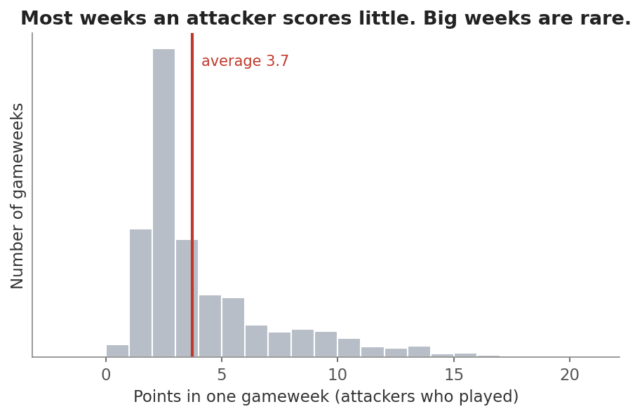
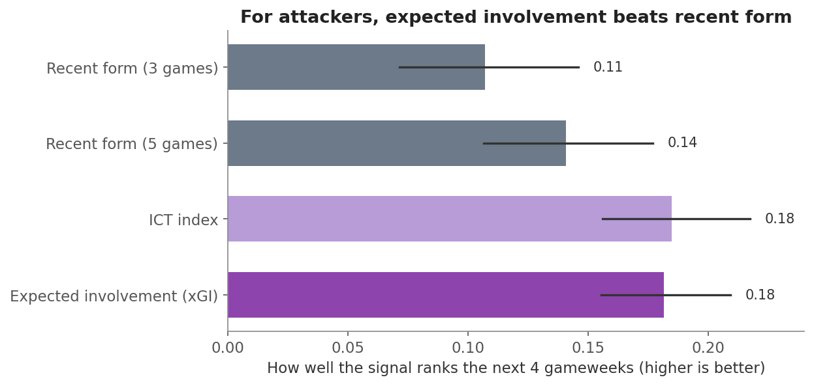
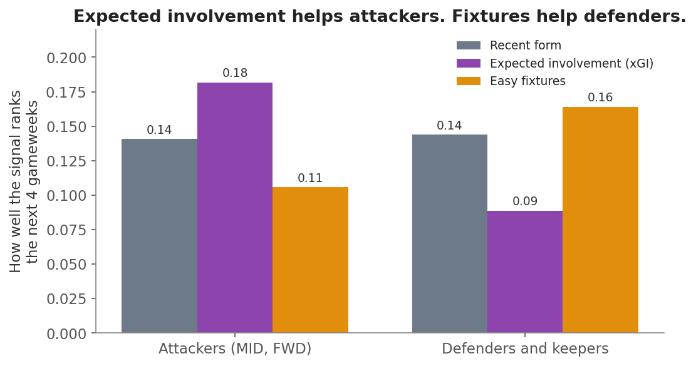
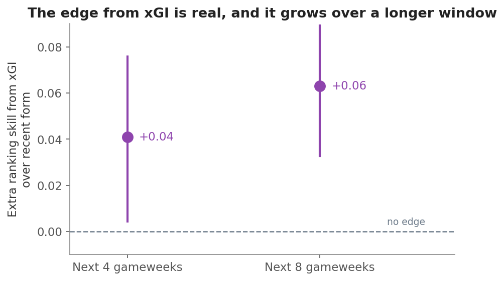
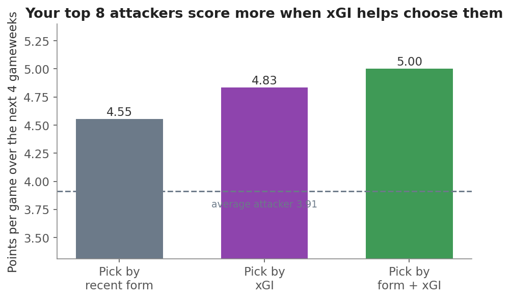
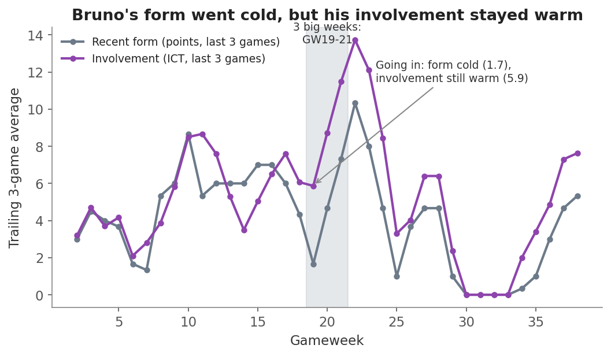

# Do the "expected" stats actually help you pick players?

**The short answer: yes, but only for attackers.**

You already pick players in a smart way. You check minutes first. Then you sort by form.
Then you look at fixtures and ownership. Your question was simple: do the expected stats,
like expected goal involvement (xGI) and the ICT index, add anything on top of that?

This story walks through the answer step by step. It starts simple and builds up. Every
number comes from this season's Premier League data, GW1 to GW38, for all 841 players.
We only ever use what you would have known at the time. When we test a pick for gameweek N,
we only look at games up to gameweek N minus 1. Nothing from the future leaks in.

---

## Step 1: Why one or two good games can fool you

Look at how attackers score. Most weeks they score very little. Once in a while they blow up.

The pile sits on the left. Big scores are rare and far to the right. This is the whole
problem. If you judge a player on his last game or two, you are reading a lot of luck. A
player can look hot after one lucky week and cold after one quiet week. You need a signal
that is steadier than raw points.

That is what the expected stats try to be. Expected goal involvement (xGI) counts the
quality of the chances a player gets and creates, whether or not the ball went in. It moves
more smoothly than goals, because it does not wait for lucky finishes.

---

## Step 2: Which signal picks better attackers?

Here is the key test. For each attacker, we take a trailing signal (what he did in recent
games) and check how well it ranks his points over the next four gameweeks. A higher score
means the signal sorts good picks from bad picks better.

Expected involvement (xGI) beats recent form. Three-game form is the weakest of all, because
it is the noisiest. Five-game form is better, but xGI is better still. The ICT index scores
almost the same as xGI. That makes sense, because ICT already has a lot of the same shooting
and creating info baked in. So you do not need both. Pick xGI.

The black lines on each bar show the range we are confident about. Even at the low end of
xGI's range, it still beats form. This is not a fluke of one or two weeks.

---

## Step 3: The story changes by position

Now we split players into two groups. Attackers on the left. Defenders and keepers on the right.

The picture flips. For attackers, xGI is the tallest bar. For defenders and keepers, xGI is
the shortest bar, and easy fixtures matter most. This is logical. Defenders and keepers earn
points from clean sheets, and clean sheets depend on who they play, not on their own shots.

So the rule splits in two. For attackers, lean on xGI. For defenders, lean on fixtures.
For defenders, the most useful expected stat is not xGI at all. It is expected goals
conceded, which tells you how likely their team is to keep a clean sheet.

---

## Step 4: The edge is real, and it grows

You might ask if this edge is worth the trouble. Let us measure it directly. We take the
extra ranking skill that xGI gives you over recent form, for attackers, at two horizons.

Both dots sit above the "no edge" line, and both ranges stay above it. So the edge is real.
And it gets bigger when you look further ahead. Over eight gameweeks, xGI helps more than it
does over four. This fits the idea that luck evens out over time, and the true quality that
xGI measures shows up more clearly the longer you wait.

---

## Step 5: What this is worth in points

Numbers about "ranking skill" are a bit abstract. So here is the plain version. Each week we
build a shortlist of the top eight attackers three ways: by form only, by xGI only, and by
form and xGI together. Then we see how many points those picks actually scored next.

Picking by form gets you 4.55 points per game. Picking by xGI gets you 4.83. Picking by both
together gets you 5.00. The average attacker scored 3.91, so all three methods beat luck, but
form plus xGI wins. That gap of about half a point per game, per attacker, adds up fast across
your team and across a month of fixtures. It is a real edge, not a magic trick.

Notice that form and xGI work best together. xGI does not replace form. It adds to it.

---

## Step 6: So what about Bruno?

You brought in Bruno Guimaraes, and he then had three big weeks in a row. Was that luck, or
did the data see it coming? Here is his season. The grey line is his recent form in points.
The purple line is his recent involvement in ICT.

Look at the moment just before his hot streak, at the shaded band (GW19 to GW21). His form
had gone cold. His last three games gave him only 1.7 points per game. If you followed form
alone, you would have looked away. But his involvement stayed warm. He kept getting into good
spots. That gap, cold points but warm involvement, is exactly the signal that points are
about to bounce back. And they did.

So it was not pure luck, and it was not a sure thing either. His involvement was steady, not
sky high, so some of that haul was good fortune. But the expected data gave a hint that form
alone completely missed. That is the whole point of this story, shown in one player.

---

## What to do

- **Keep your process.** Minutes first, then form, then fixtures and ownership. That still works.
- **Add xGI as one more screen for attackers.** When two attackers look similar on form, let
  xGI break the tie. Trust the one with the stronger recent involvement.
- **Use form and xGI together, not one alone.** They are strongest as a pair.
- **Skip ICT if you have xGI.** They tell you almost the same thing.
- **Do not use xGI for defenders and keepers.** For them, chase easy fixtures and low expected
  goals conceded instead.
- **Treat this as an edge, not a promise.** It is worth about half a point per game per
  attacker at the top of your shortlist. It will not win you every week, but it tilts the odds
  your way over a month.

## Things to keep in mind

- This uses one season of data. The pattern is steady across this season's weeks, and public
  football numbers back it up across other seasons too, but treat the exact sizes as a guide,
  not a law.
- xGI counts penalties, so penalty takers score high on it. That is fair, because they are
  good picks, but it is worth knowing why they stand out.
- We only tested players who were playing regular minutes, which is the same group you would
  actually choose from. So the finding applies to real decisions, not to bench players.

## How we measured it (in plain words)

We lined up every player and every gameweek. For each one, we looked only at past games to
build the signals, then checked how the player did in the next four to eight games. We scored
how well each signal sorted good picks from bad ones. We repeated the whole test many times on
resampled weeks to make sure the answer was steady and not down to a few lucky gameweeks. We
also ran a stricter test where the method only ever learned from earlier weeks and then had to
call later weeks blind. xGI passed every version of the test for attackers.
