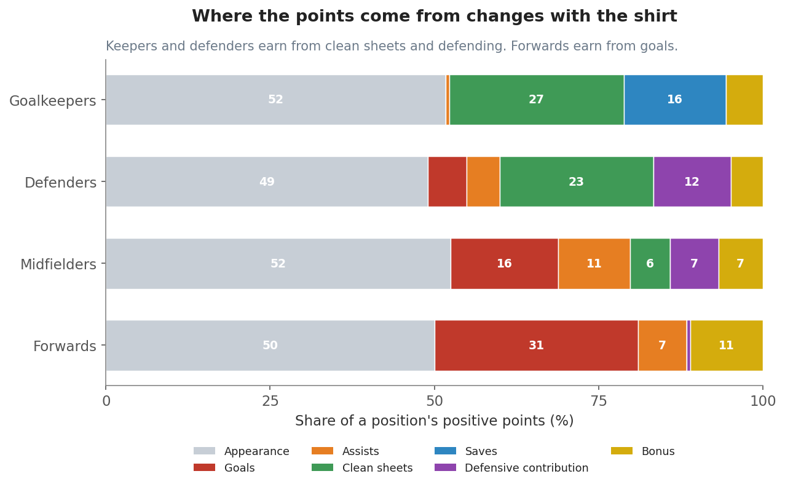
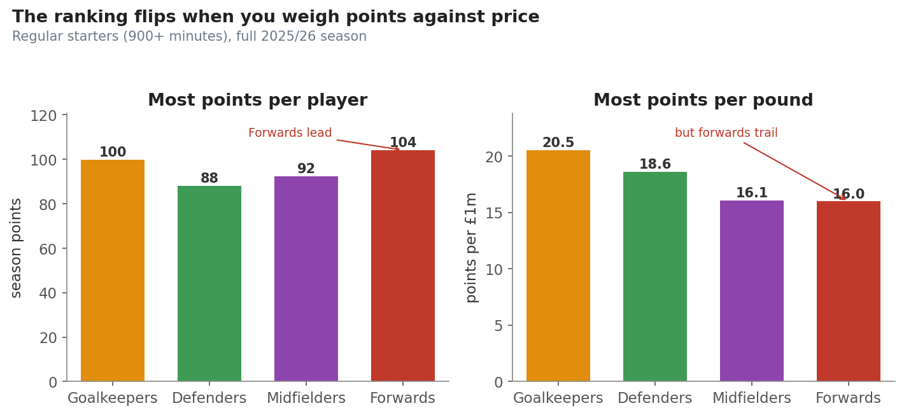
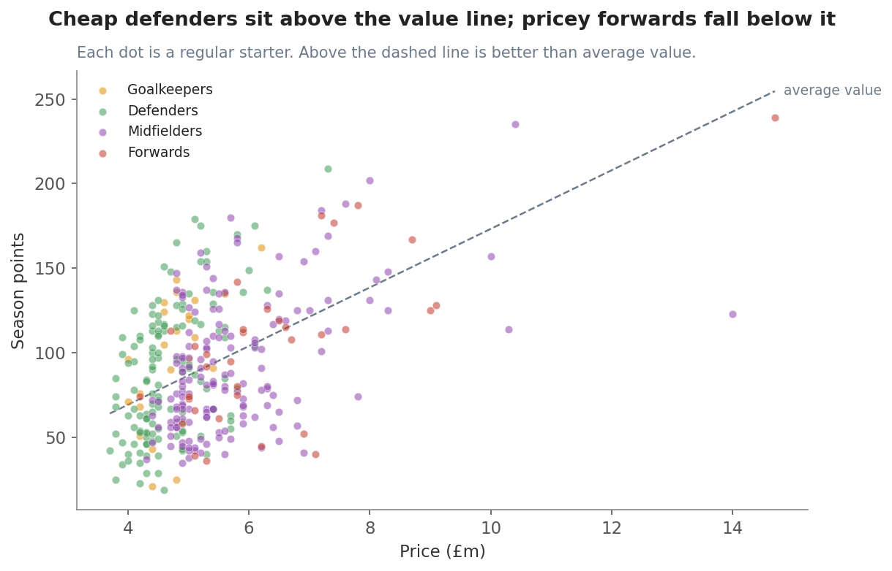

# Where do FPL points come from, and which position is best value?

**The short answer: forwards and midfielders score the most points, but keepers and
defenders give you the most points for your money. Build your spine cheap, then pay up for a
few attackers.**

You have a fixed budget. Every pound you spend on one player is a pound you cannot spend on
another. So two questions matter. First, how does each position actually earn its points?
Second, which position gives you the best points for the price?

This story answers both. It uses the full 2025/26 Premier League season, all 841 players and
every gameweek. We rebuilt each player's points from the scoring rules, and our rebuilt totals
match the real totals for 99.7% of rows. This is the whole season, not a sample, so these are
facts about what happened.

---

## Step 1: Each position earns its points in a different way

Look at how each position builds its score.

Every position earns a big base just for playing. Getting 60 minutes is worth 2 points, and
that steady drip is about half of every position's points.

After that, the shirts split apart:

- **Goalkeepers** earn from clean sheets and saves. They stop goals for a living.
- **Defenders** earn from clean sheets too, plus the new points for defending, like tackles
  and blocks. That defensive work is now 12% of their points.
- **Midfielders** earn a balanced mix of goals and assists.
- **Forwards** earn from goals, and almost nothing else. Goals are 31% of their points.

So the action that matters most depends on the position. For keepers and defenders, it is
keeping the ball out. For forwards, it is putting the ball in.

---

## Step 2: The best scorers are not the best value

Now the money question. On the left, we show how many points each position scores per player.
On the right, we show how many points each position gives per £1 million of price.

The ranking flips. Forwards score the most points per player, but they give you the fewest
points per pound. Goalkeepers and defenders are the opposite. They score fewer total points,
but they are cheap, so every pound works harder.

Why? Forwards cost the most, and you pay a premium for their goal ceiling. Keepers and
defenders are cheap, they play almost every minute, and the new defending points now reward
them for work they already do.

---

## Step 3: Why defenders win on value

Here is the same idea in one picture. Each dot is a regular starter. The dashed line marks
average value. Dots above the line beat average value. Dots below it fall short.

Look at where the colours sit. Green defenders cluster in the top-left corner, cheap but
productive, sitting above the line. Red forwards spread out to the right, where prices climb,
and many of them fall below the line. That gap is the whole story. You can buy defender points
cheaply. Forward points cost a premium.

---

## What to do

- **Build your spine from value.** A cheap, nailed-on keeper and cheap defenders who play
  every minute give you the most points per pound. Start there.
- **Pay up for one or two attackers.** Forwards and top midfielders win you weeks with goals.
  That ceiling is worth the premium, but only for a few players, not your whole team.
- **Do not chase expensive forwards for raw points.** That is the least efficient way to spend
  your budget. One or two is plenty.
- **Match the stat to the shirt.** Judge keepers and defenders on clean sheets and fixtures.
  Judge forwards on goals.

## Things to keep in mind

- This is one season. The new defending points arrived in 2025/26, so the defender value boost
  may not show up in past seasons.
- Value here uses season-total points, which rewards players who never rotate. Keepers look
  great partly because they play every minute, not only because they are skilful.
- We only counted regular starters, players with 900 minutes or more. That is the group you
  would actually pick from, so the finding applies to real decisions.

## How we measured it (in plain words)

We took every player and every gameweek for the whole season. We rebuilt each player's points
from the official scoring rules, then checked that our rebuilt totals matched the real ones.
They matched almost perfectly. We added up the points each way to see where they come from. For
value, we divided each player's season points by their price to get points per pound, and we
checked that the ranking held for players with more or fewer minutes. It did.
