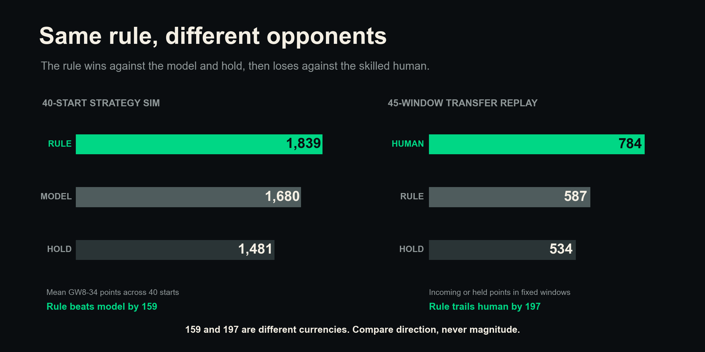
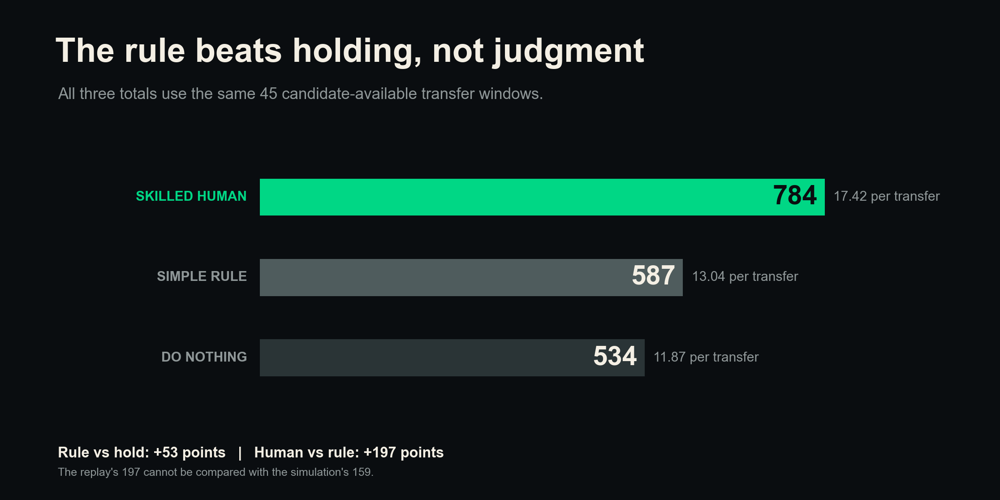
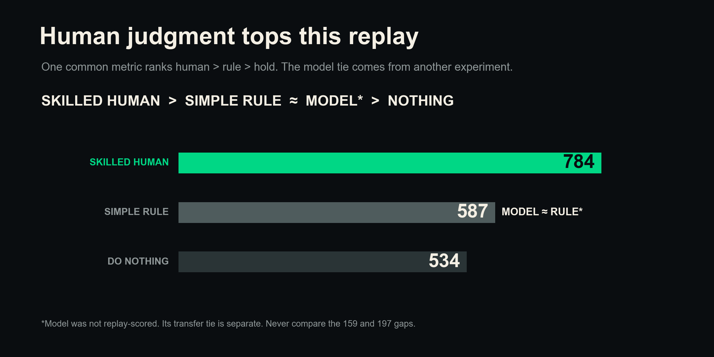
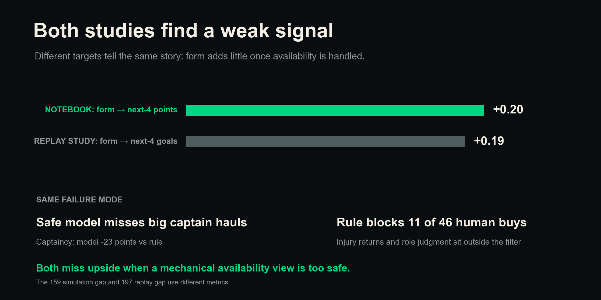

# The two FPL studies tell one clear story

**Short answer: the simple rule beat the model and beat holding, but your actual transfer choices beat the rule. The results do not conflict because each test used a different opponent.**

First, one warning matters more than any chart:

**The 159-point gap and the 197-point gap use different measures. Do not add them, subtract them, or compare their size.**

The 159 came from a 40-start full season strategy simulation. The 197 came from one manager's incoming-player transfer replay. We can compare which approach ranked higher. We cannot treat the two point gaps as the same currency.

## 1. The rule faced different opponents

The notebook asked whether a simple rule could beat a prediction model and a no-transfer strategy.

It could. Across 40 starting squads from GW8 to GW34, the simple strategy averaged **1,839 points**. The model averaged **1,680**. The no-transfer strategy averaged **1,481**.

The replay asked whether the same kind of simple form rule could beat your real incoming players.

It could not. Across 45 scored transfer windows, your buys scored **784 points**. The rule scored **587**.

That is the whole key. The rule won one fight and lost another.

## 2. One fair replay scale settles the order

We added a do-nothing baseline to the transfer replay.

For every move, we kept the outgoing player and counted that player's points over the same holding window as the real incoming player. This put all three choices on one scale.

- Your incoming players scored **784**, or **17.42 per transfer window**.
- The simple rule scored **587**, or **13.04 per transfer window**.
- Keeping the outgoing player scored **534**, or **11.87 per transfer window**.

The rule beat holding by **53 points**. Your choices beat the rule by **197 points**.

## 3. The useful hierarchy is simple

The common replay gives a clear order:

**skilled human > simple rule > doing nothing**

The notebook's transfer-only test put the rule and model close together. The model was **33 points behind** the rule on average, but its range ran from **155 behind to 53 ahead**. That range crosses zero, so we should call it a tie.

We did not give the model a replay score. Its published prediction window does not cover all 46 transfer decisions without changing the model. A partial score would look more complete than it is.

So the full evidence supports this broad order:

**skilled human > simple rule about equal to model > doing nothing**

The model marker comes from the separate transfer simulation. It does not sit on the replay point scale. The 159 and 197 gaps still must not be compared.

## 4. Both studies say form is weak

We rebuilt the notebook's form test from the player gameweek data.

Across **23,911** complete player decisions, recent four-gameweek points had a **0.79 rank link** with points over the next four gameweeks.

Then we kept only players with at least **180 minutes in the recent four gameweeks**. Across **6,786** rows, the link fell to **0.20**.

That exact screen reproduces the notebook chart. It uses past minutes as an availability screen. It does not filter on who played in the future.

The replay story found a similar **+0.19** link between form and goals over the next four gameweeks. The targets differ. One uses points and one uses goals. Both links are small once we focus on players who have been playing.

## 5. Both studies find the same weak spot

The model played captaincy too safely. In the 40-start simulation, it finished **23 captain points per season behind** the simple rule. Its 95% range stayed below zero.

The transfer rule also played availability too safely. **11 of your 46 actual buys** failed at least one locked filter. Injury or rotation returns such as Gabriel and Saka could sit outside a simple prior-minutes screen.

These are not the same decisions, but they point to the same limit. A safe rule can miss upside when a player's role changes or when one big haul matters.

## 6. The rule is a floor, not a ceiling

The simple rule still has real value.

It beat holding on the common replay. It also matched the model on transfers in the separate simulation. It is cheap, clear, and hard to overthink.

But it did not match your actual buys. A strong manager can use news, role changes, injury returns, fixtures, and the full transfer package in a way that a fixed form rule cannot.

Use the rule to protect the floor. Keep judgment for the ceiling.

## What to do

- **Start with availability.** Check starts, recent minutes, injury news, and likely role.
- **Use form as a shortlist signal.** Do not let recent FPL points make the final call alone.
- **Add upside.** Review xGI, set pieces, role changes, fixture quality, and captain potential.
- **Review the whole package.** Count the bank and cash released by every planned sale.
- **Use a simple rule as a guardrail.** Ask human judgment to explain every move away from it.
- **Judge new models on points.** Make them beat the simple rule in a full decision test, not only in a prediction test.

## Things to keep in mind

- This covers one manager and one season. Luck can affect large holding-window gaps.
- The replay counts player points, not starting-XI points. It leaves out captaincy, benching, and transfer hits.
- The replay gives each transfer leg the prior bank. Real multi-transfer packages share cash.
- Four real buys used cash released by another move in the same gameweek.
- Only 35 of 46 real incoming players passed every rule filter.
- The no-transfer strategy in the notebook means no transfers. It still uses the model for squad selection and captaincy.
- The model's layer tests do not add up to the full 159-point result because each layer holds the other choices fixed.
- The +0.20 test targets next-four-gameweek points. The +0.19 test targets next-four-gameweek goals.
- **The 159 simulation gap and 197 replay gap are different measures and are not comparable.**

## How we measured it

For the replay, we used the 46 non-chip transfers in the bank-aware results. The rule had a candidate in 45 rows. We scored the actual incoming player, the rule pick, and the outgoing player over the same inclusive window from transfer GW `T` through the real incoming player's final holding GW. Missing rows counted as zero.

For the form test, we built one row for each player and decision GW from GW4 to GW34. Recent form used points from `t-3` through `t`. The target used points from `t+1` through `t+4`. We required all eight rows to exist. We then measured Spearman rank correlation for all rows and for the 180-minute trailing screen.

For the notebook simulation, we reran `src/fpl_retro/v1_engine.py`. It used 40 sampled GW8 squads, valid formations, bench order, auto-subs, captains, banked free transfers, hits, and chip exclusions through GW34. The rerun matched the notebook's hardcoded totals and ranges.

We left the model off the replay scale because the published model window cannot score every transfer at a clean pre-deadline point. We kept its placement qualitative and tied only to the separate transfer-layer result.
