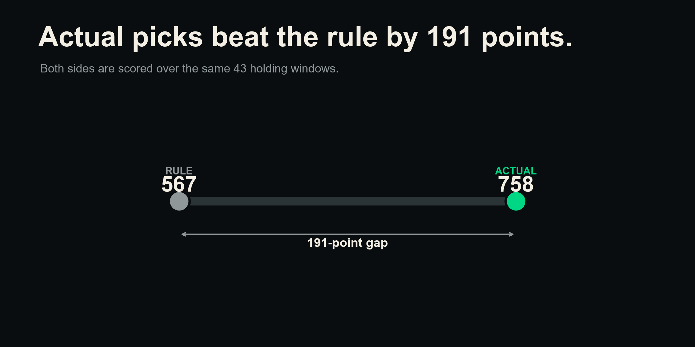
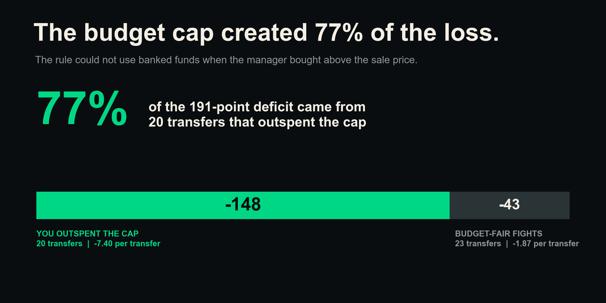
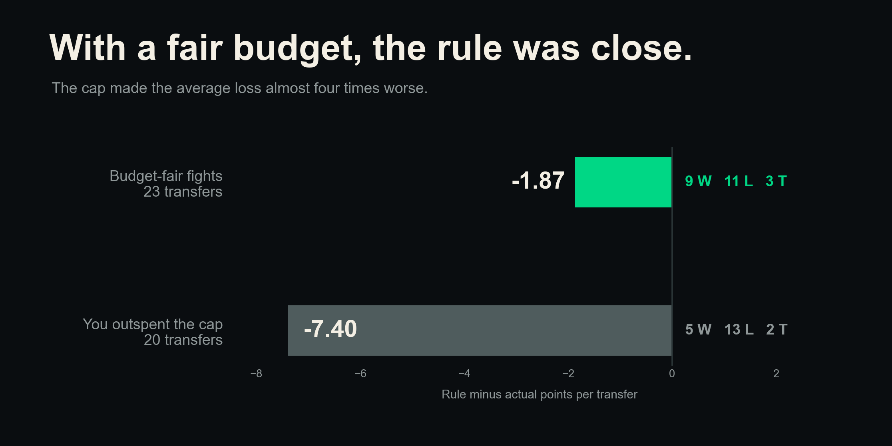
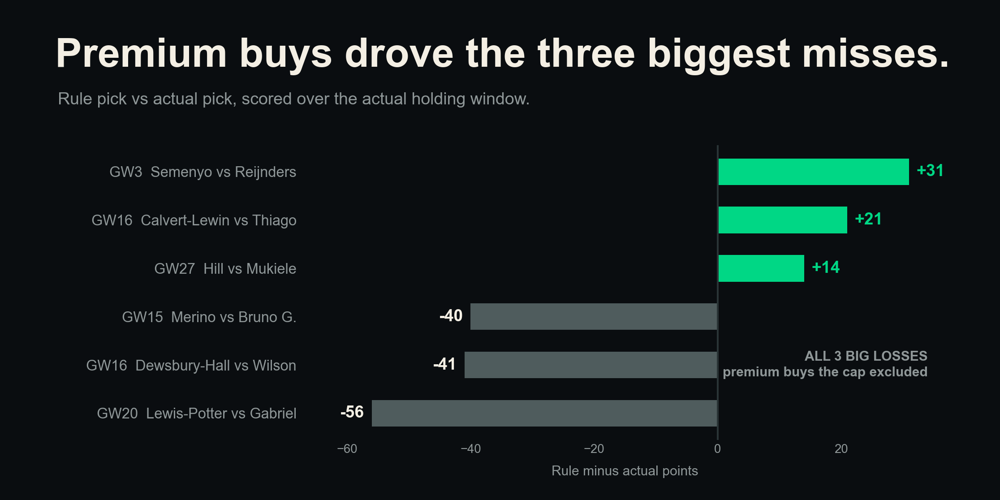

# The simple transfer rule lost because it could not use banked cash

**Short answer: your actual picks would have scored 191 more points than the rule. But 77% of that gap came from a budget limit the rule set for itself.**

## 1. Your actual picks won the full replay

We replayed 46 of your real transfers from the 2025/26 season. We left out chip weeks. The rule found a player for 43 transfers and had no candidate for 3.

Across the 43 scored transfers, your actual picks got **758 points**. The rule picks got **567 points** over the same holding windows. That is a **191-point loss for the rule**, or **4.44 points per scored transfer**.

The rule won 14 transfers, lost 24, and tied 5. It picked the same incoming player as you only 3 times out of 46.

## 2. Most of the gap came from the rule's budget cap

The rule could spend only the sale price of the outgoing player. You could also use money saved in the bank.

You spent above the sale price on 20 of the 43 scored transfers. On those moves, the rule lost **148 points**, or **7.40 points per transfer**. That is **77% of the full 191-point gap**.

This is the main twist. The rule did not just make different player calls. It entered 20 fights with less money than you used.

## 3. The rule came much closer in fair fights

There were 23 transfers where your actual buy cost no more than the outgoing sale price. In these budget-fair fights, the rule lost **43 points**, or **1.87 points per transfer**.

The result was close: 9 wins, 11 losses, and 3 ties. This does not prove the rule was as good as your judgment. The group is small. But it shows that the strict budget cap made the rule look much worse.

## 4. Six transfers show how big the swings were

The rule had some strong wins:

- GW3: Semenyo scored 52 points while Reijnders scored 21, a **+31** win.
- GW16: Calvert-Lewin scored 30 while Thiago scored 9, a **+21** win.
- GW27: Hill scored 51 while Mukiele scored 37, a **+14** win.

Its biggest losses were larger:

- GW20: Lewis-Potter scored 56 while Gabriel scored 112, a **-56** loss.
- GW16: Dewsbury-Hall scored 1 while Wilson scored 42, a **-41** loss.
- GW15: Merino scored 9 while Bruno G. scored 49, a **-40** loss.

All three big losses came when your actual pick cost more than the sale price. The cap kept those premium buys out of the rule's player pool.

## 5. Raw form is also a weak signal on its own

The rule ranks players by their points form over the last four gameweeks. Prior work in this project found a stronger signal for attackers.

Trailing xGI, which measures expected goal and assist threat, had a **+0.35 Spearman link** with goals over the next four gameweeks. Trailing form had a weaker **+0.19 link**.

That does not mean xGI can predict every result. It means raw form is a weak engine for an automatic transfer rule.

## What to do

- **Keep your judgment.** It beat this rule over the season replay.
- **Never cap a buy at the outgoing sale price.** Keep banked funds in the choice set.
- **Use a screen, not an autopilot.** A screen should narrow the list before you make the final call.
- **Screen attackers with trailing xGI, not raw form alone.** Keep the minutes check to avoid weak playing-time bets.

## Things to keep in mind

- This is a descriptive replay, not a causal test. It shows what the rule would have scored under fixed replay choices.
- It covers one manager and one season. The main scored sample is small at **n=43**.
- Candidate prices are season-static values, not the prices known at each deadline. The conclusion stayed negative in cap checks of +£0.3m and -£0.3m, with totals of **-209** and **-229** points.
- The holding-window score ignores captaincy, benching, and how several transfers work together as one package.
- The fair-fight group has only **n=23** transfers. Near parity is a useful sign, not a precise estimate.

## How we measured it (in plain words)

For each real transfer outside chip gameweeks 6, 13, 23, and 34, we looked only at the four gameweeks before the move. We kept same-position players who were outside the prior squad, cost no more than the outgoing sale price, and averaged at least 45 minutes across those four weeks. The rule then chose the player with the best four-week points form.

We scored the rule pick and your actual pick over the exact time you held the actual player. We used rule points minus actual points as the gap. Three transfers had no rule candidate, so we recorded them as pushes and left them out of the 43 scored-transfer totals.
