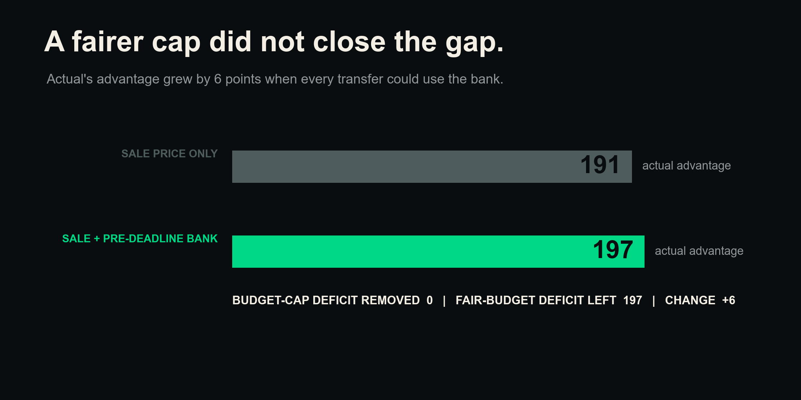
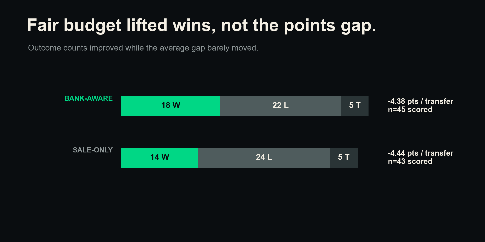
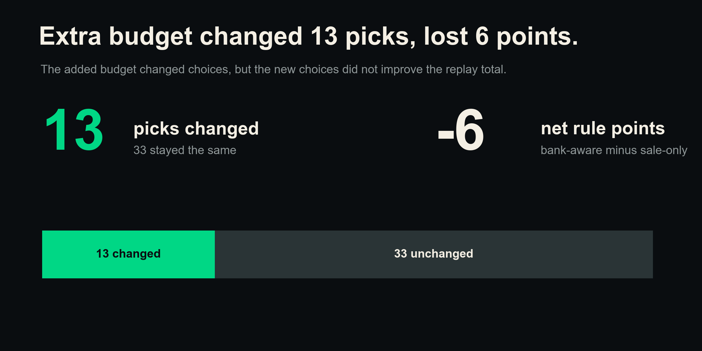
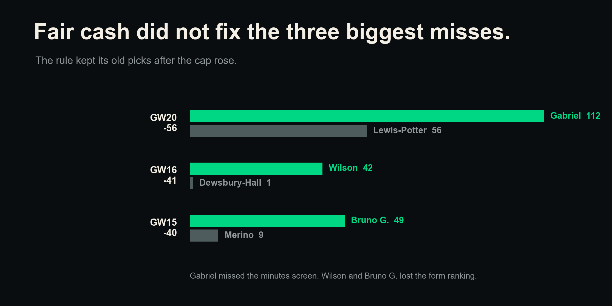

# The fair-budget rematch still favored your transfer choices

**Short answer: the bank-aware rule would have finished 197 points behind your actual picks. Adding the bank changed 13 picks, but it made the replay result 6 points worse than the sale-only rule.**

## 1. We gave the rule a fairer budget

The first replay let the rule spend only the sale price of the outgoing player. That was too strict. You could also carry cash in the bank.

This rematch adds the bank shown at the end of the prior gameweek. For a transfer in GW T, the new cap is:

**outgoing sale price + bank from GW T-1**

Everything else stays the same. The rule still uses only the four gameweeks before the move. It still keeps the position and minutes screens. It still ranks players by four-gameweek points form.

## 2. The fairer cap did not close the gap

The bank-aware rule found a candidate for 45 of the 46 transfers. Your actual picks scored **784 points** in those holding windows. The rule picks scored **587 points**.

That left the rule **197 points behind**, a **-197 rule-minus-actual result**, or **4.38 points per scored transfer**. The sale-only rule finished at **-191 points**. So the added bank did not remove any of the old gap. The gap grew by 6 points in this replay.

This does not mean extra budget hurts transfer choices. It means the new players chosen by this form rule would have scored 6 fewer points than the old rule picks over these fixed windows.

## 3. The rule won more fights, but the total stayed weak

The new rule won **18** transfer fights, lost **22**, and tied **5**. The sale-only rule went 14 wins, 24 losses, and 5 ties.

That sounds better, but the size of each result matters. The average stayed almost flat at **-4.38 points per scored transfer**, compared with **-4.44** before. A few large losses still outweighed the extra wins.

The rule matched your actual incoming player only **3 times out of 46**, or **6.5%**.

## 4. More money changed choices, not quality

Adding the bank changed **13 of the 46 rule picks**. The other 33 stayed the same.

Those changes had a **-6 point net effect** for the rule. The fairer choice set did not fix the weak ranking engine. It only gave that engine more players to rank.

## 5. The three old big losses survived

The earlier replay had three painful misses. The fair cap did not change any of them:

- GW20: the rule still picked Lewis-Potter for 56 points instead of Gabriel for 112, a **-56** result. Gabriel was affordable, but he failed the locked prior-minutes screen.
- GW16: the rule still picked Dewsbury-Hall for 1 point instead of Wilson for 42, a **-41** result. Wilson was affordable, but the form ranking chose Dewsbury-Hall.
- GW15: the rule still picked Merino for 9 points instead of Bruno G. for 49, a **-40** result. Bruno G. was affordable, but the form ranking chose Merino.

The fair budget reached the right price tier for these slots. The unchanged minutes and form rules still sent it elsewhere.

## 6. Form still looks like a weak engine

The budget was not the full answer. The rule still ranked candidates by recent FPL points.

Prior attacker work in this project found that trailing xGI had a **+0.35 Spearman link** with goals over the next four gameweeks. Trailing form had a weaker **+0.19 link**.

These links do not promise future points. They suggest that recent chance quality may carry more useful signal than recent FPL points alone.

## What to do

- **Use the full transfer-package budget.** Count the bank and cash released by every planned sale.
- **Use form to add context, not to make the final pick.** A high recent score can come from a small run of lucky returns.
- **Use trailing xGI for attacker screens.** Add minutes, role, fixtures, price, and team fit before deciding.
- **Review multi-transfer moves as one package.** Do not judge each leg with a separate pot of cash.
- **Keep human judgment at the end.** Let a rule make a shortlist, then make the transfer call with the full squad in view.

## Things to keep in mind

- This is a descriptive replay for one manager and one season. It does not show cause and effect.
- The primary result gives the full prior bank to every transfer leg. In real multi-transfer weeks, the legs share one bank.
- **37 of 46 transfers** happened in multi-transfer gameweeks. In a stricter sensitivity, only the first leg used the bank. That version finished at **-170 points** across 43 scored rows, which was 27 points better than the primary result. The samples differ because the sensitivity had three no-candidate pushes.
- Four actual buys cost more than their own sale plus bank because another transfer in the same gameweek released cash. This affected Pedro Porro in GW3, Mbeumo in GW12, Ekitiké in GW18, and Palmer in GW27.
- Only **35 of 46 actual incoming players** passed every locked candidate filter. Ten scored rows excluded the actual player due to the feature-price cap or the prior-minutes rule. One more row had no candidate.
- Candidate prices come from the same processed feature table used by the first replay. Actual buy and sale prices come from the transfer records. This keeps the budget change isolated, but the two price fields can differ.
- Holding-window points ignore captaincy, benching, transfer hits, and whether the rule pick would have started.
- Large player-level swings can include luck, injuries, fixture changes, and events that nobody knew at the deadline.

## How we measured it

We replayed the manager's 46 non-chip transfers. We excluded GWs 6, 13, 23, and 34.

For a move in GW T, we read the squad and bank from `event_{T-1}.json`. We divided the stored bank by 10 to turn tenths into £m. We then kept same-position players who were outside the prior squad, were not another actual incoming player that week, cost no more than sale plus bank, and averaged at least 45 minutes over GWs T-4 through T-1.

The rule chose the highest four-gameweek mean points. Ties went to higher mean minutes, then lower price, then lower player ID. We scored the rule pick and actual pick over the same real holding window. Missing gameweeks counted as zero.

The shared-bank sensitivity kept the same transfer order. Only the first non-chip transfer in each gameweek added the bank. Later transfers used the outgoing sale price only.
