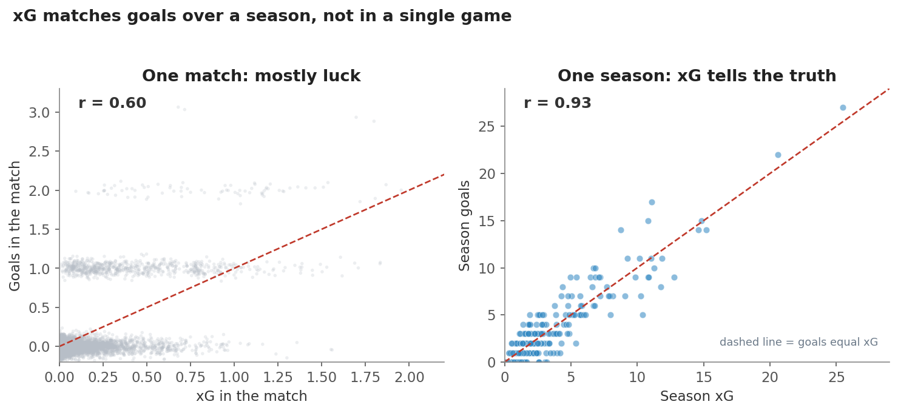
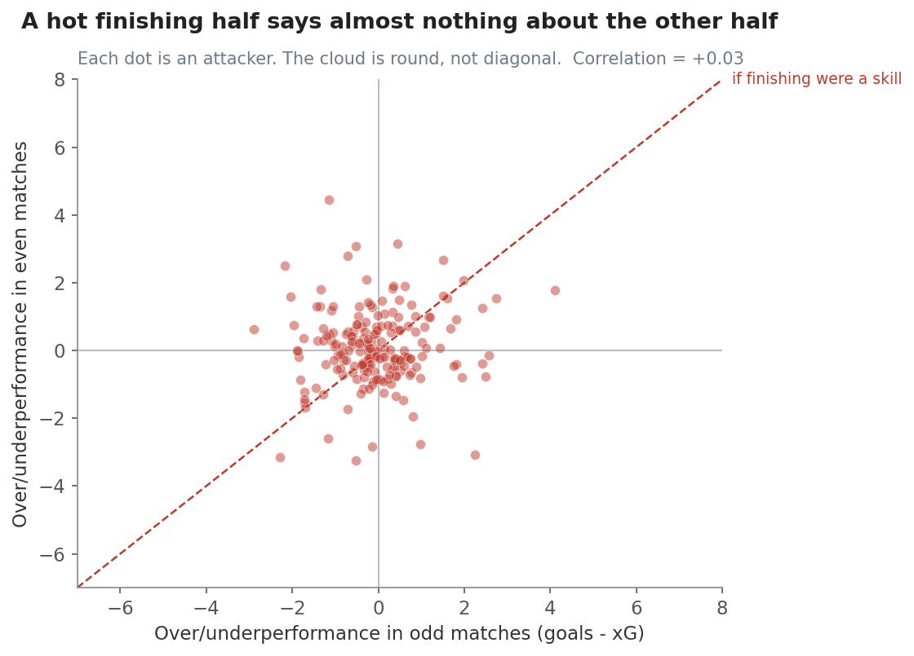
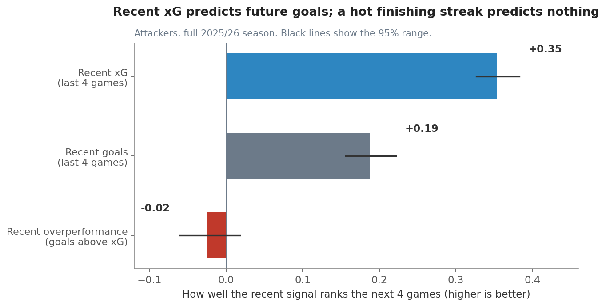

# xG and goals: buy the xG, fade the hot streak

**The short answer: recent xG tells you who will score next. A hot finishing streak does not.**

You want to know two things. Does xG line up with goals? And if a player is banging in goals
above his xG, can you trust that to continue? This story answers both, step by step, from
simple to complex. It uses the full 2025/26 Premier League season, all 841 players, and it only
ever looks at what you would have known at the time.

---

## Step 1: xG matches goals over a season, not in one game

Start with the basic question. Does xG track goals?

Look at the two pictures. On the left, each dot is one match. Goals only come in whole numbers,
so the dots sit in flat rows, and a single game is mostly luck. The link is loose. On the right,
each dot is a player's whole season. Now the dots hug the line. Over a full season, a player's
goals and his xG almost match (they line up at 0.93 out of 1).

So xG is a season-level truth-teller, not a one-game predictor. One good game means little. A
big pile of xG over many games means a lot.

---

## Step 2: Beating your xG does not repeat

Some players did finish above their xG this season. The question is whether that is a real
skill you can count on, or just good luck that comes and goes.

Here is a clean test. We split each attacker's season into two halves, his odd-numbered games
and his even-numbered games. Then we check: if he beat his xG in one half, did he beat it in the
other?

If finishing were a steady skill, the dots would line up along the diagonal. They do not. The
cloud is round and centered on zero. A player who ran hot in one half was just as likely to run
cold in the other. The match is almost zero (0.03 out of 1).

In plain words, beating your xG this season looks like luck, not skill. It does not carry over.

---

## Step 3: So what should you actually watch?

Now the payoff. For each attacker, we take a recent signal and check how well it ranks his goals
over the next four games. We test three signals: his recent xG, his recent goals, and his recent
overperformance (how far his goals ran above his xG).

Recent xG wins by a mile. It ranks the next four games about twice as well as recent goals do
(0.35 versus 0.19). Why? Because recent goals carry all the finishing luck, and luck does not
repeat. Recent xG strips that luck out and leaves the part that lasts.

And recent overperformance? It lands at zero. A player scoring above his xG right now tells you
nothing about his goals to come. The hot streak is a mirage.

---

## What to do

- **Screen attackers on recent xG, not recent goals.** A four or five game xG average is your
  best simple signal for who scores next.
- **Do not chase a hot finishing streak.** When a player's goals are running above his xG, that
  gap is the part least likely to continue. Expect it to fade.
- **Look for the opposite too.** A player creating good chances but not scoring yet is scoring
  below his xG. He is often the better buy, because the goals tend to follow the chances.
- **Judge finishing over a season, not a month.** xG only tells the truth once the games pile up.

## Things to keep in mind

- This is predictive, not proof of cause. Recent xG is linked with future goals. It does not
  make goals happen.
- xG counts penalties, so penalty takers show high xG and convert them reliably. That is a fair
  reason they screen well, but it is worth knowing why they stand out.
- Recent xG partly works by spotting genuinely good attackers, not only by calling short-term
  swings. That is still exactly what you want for picking players.
- This is one season and one xG provider. A few elite finishers may be real exceptions. The
  no-skill verdict is the rule for the group, not a promise about any single star.

## How we measured it (in plain words)

We lined up every attacker and every game. We only used games a player actually played, and we
only used the past to build each signal, then checked the future. We measured how well each
recent signal sorted good weeks from bad ones. We repeated the whole test on resampled weeks to
get a range, and we reran it over three, four, and five game windows and for forwards alone. xG
beat goals every single time, and overperformance never predicted itself.
